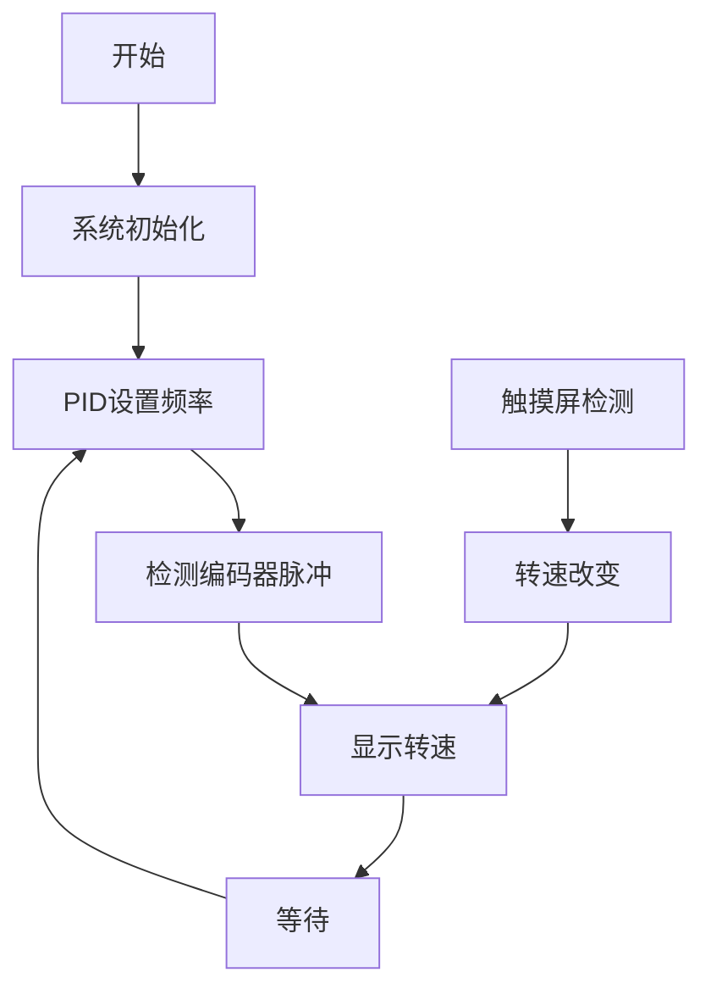
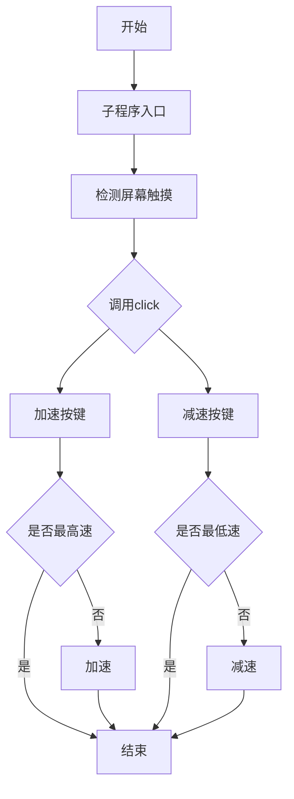
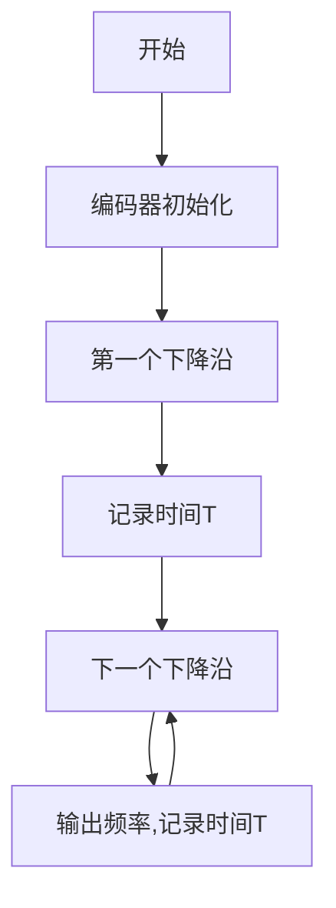

```mermaid
graph TD;
    开始-->系统初始化-->PID设置频率-->检测编码器脉冲-->显示转速;
    触摸屏检测-->转速改变-->显示转速;
    显示转速-->等待-->PID设置频率;
```

```mermaid
graph TD;
    开始-->子程序入口-->检测屏幕触摸-->调用按键click程序{调用click}
    调用按键click程序-->加速按键-->是否最高速{是否最高速}--是-->结束
    调用按键click程序-->减速按键-->是否最低速{是否最低速}--是-->结束;
    是否最高速--否-->加速-->结束
    是否最低速--否-->减速-->结束
```

```mermaid
graph TD;
    开始-->编码器初始化-->第一个下降沿-->记录时间T-->下一个下降沿-->输出频率,记录时间T-->下一个下降沿
    
```